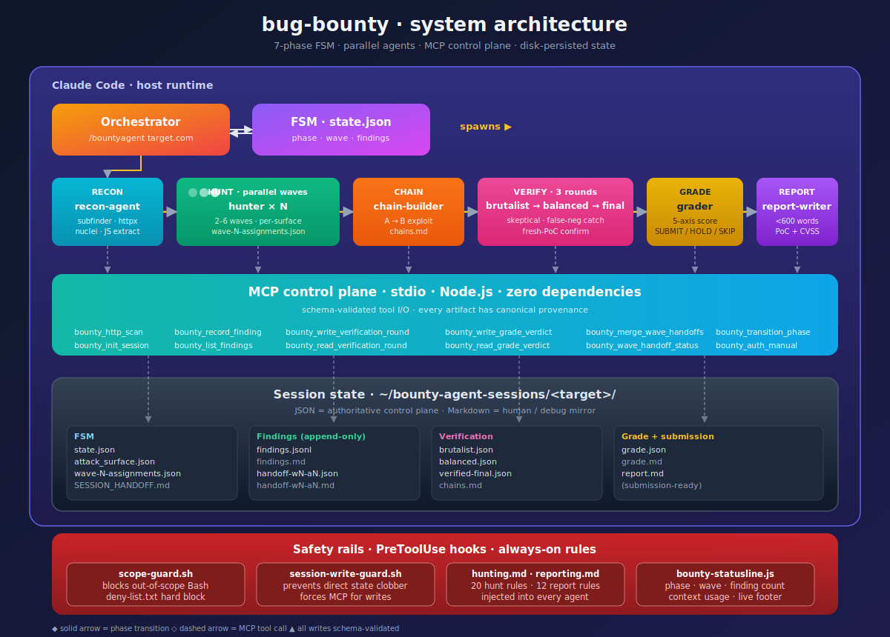

# bug-bounty

Autonomous bug bounty hunting framework for Claude Code. A 7-phase finite state machine orchestrates specialized AI agents that do recon, hunt in parallel waves, verify findings across three skeptical rounds, grade them on a 5-axis rubric, and produce submission-ready reports — end to end from a single slash command.

> Based on the original [`vmihalis/bounty-agent`](https://github.com/vmihalis/bounty-agent) framework. Republished here with architecture documentation and modifications.



---

## Table of Contents

1. [What it is](#what-it-is)
2. [Why this architecture](#why-this-architecture)
3. [System architecture](#system-architecture)
4. [The 7-phase FSM](#the-7-phase-fsm)
5. [Agent catalog](#agent-catalog)
6. [MCP control plane](#mcp-control-plane)
7. [Safety rails](#safety-rails)
8. [Directory layout](#directory-layout)
9. [Data model](#data-model)
10. [Install & usage](#install--usage)
11. [Tech stack](#tech-stack)
12. [Quality assessment](#quality-assessment)

---

## What it is

A multi-agent orchestration layer that turns Claude Code into a semi-autonomous bug bounty hunter. You give it one command:

```
/bountyagent target.com
```

…and it runs the full pipeline: recon → auth → parallel hunting waves → chain-building → three-round verification → grading → report writing. State is persisted to disk between phases, so long runs can be paused and resumed.

It is **not**:
- A scanner (nuclei/subfinder are just inputs).
- A single monolithic prompt.
- A black box — every phase writes structured JSON artifacts you can inspect.

It **is**:
- A finite state machine that knows which phase it's in and what's next.
- A set of ~10 specialized agents, each with a narrow role and tool whitelist.
- A local MCP server that acts as the control plane — findings, verifications, grades, and hand-offs all flow through typed tool calls instead of free-form prose.

## Why this architecture

The core problem with LLM-based hunting is hallucination and drift. A single long-running agent will happily invent findings, inflate severity, and forget what it already tested. This framework solves that with three decisions:

| Problem | Decision |
|---|---|
| Agents invent findings | Three adversarial verification rounds re-run PoCs with fresh HTTP requests |
| Agents inflate severity | A separate grader with a 5-axis rubric issues SUBMIT/HOLD/SKIP |
| Agents forget state | MCP server is the single source of truth — JSON files, not prose |
| Agents lose focus | Each agent is spawned per-task with a narrow tool whitelist and role prompt |
| Waves step on each other | Per-wave assignment files (`wave-N-assignments.json`) dedupe surfaces |

## System architecture

```
┌─────────────────────────────────────────────────────────────────────┐
│                        Claude Code (host)                           │
│                                                                     │
│  /bountyagent target.com                                            │
│         │                                                           │
│         ▼                                                           │
│  ┌──────────────────┐    ┌──────────────────┐                       │
│  │   Orchestrator   │◄──►│  FSM state.json  │                       │
│  │  (slash command) │    │  phase / wave    │                       │
│  └────────┬─────────┘    └──────────────────┘                       │
│           │ spawns                                                  │
│           ▼                                                         │
│  ┌──────────────────────────────────────────────────┐               │
│  │         Specialized agents (parallel)            │               │
│  │                                                  │               │
│  │  recon │ hunter × N │ chain │ verifier × 3 │ ... │               │
│  └──────────────────┬───────────────────────────────┘               │
│                     │ calls tools                                   │
│                     ▼                                               │
│  ┌──────────────────────────────────────────────────┐               │
│  │    MCP server (stdio, Node.js, zero deps)        │               │
│  │                                                  │               │
│  │  bounty_http_scan   bounty_record_finding        │               │
│  │  bounty_*_handoff   bounty_write_verification    │               │
│  │  bounty_write_grade bounty_transition_phase ...  │               │
│  └──────────────────┬───────────────────────────────┘               │
│                     │                                               │
│                     ▼                                               │
│  ┌──────────────────────────────────────────────────┐               │
│  │      Session directory (on disk, per-target)     │               │
│  │  ~/bounty-agent-sessions/target.com/             │               │
│  │   state.json │ findings.jsonl │ handoff-wN-aN.*  │               │
│  │   brutalist.json │ balanced.json │ verified.json │               │
│  │   grade.json │ report.md                         │               │
│  └──────────────────────────────────────────────────┘               │
│                                                                     │
│  PreToolUse hooks ─── scope-guard.sh  (blocks out-of-scope Bash)    │
│  StatusLine       ─── bounty-statusline.js  (phase/wave/findings)   │
└─────────────────────────────────────────────────────────────────────┘
```

### Control plane vs. data plane

- **Control plane** = structured JSON artifacts written by the MCP server. The orchestrator and every downstream agent read these. This is the only source of truth for what's been found, verified, and graded.
- **Data plane** = markdown mirrors (`findings.md`, `brutalist.md`, etc.) written best-effort for humans to eyeball. Prompts and code never parse them.

This split is deliberate — it's the main thing keeping the system deterministic enough to resume across sessions.

## The 7-phase FSM

```
RECON ──► AUTH ──► HUNT ──► CHAIN ──► VERIFY ──► GRADE ──► REPORT
  │         │        │         │         │          │         │
  ▼         ▼        ▼         ▼         ▼          ▼         ▼
recon    optional  parallel   A→B      3 rounds   5-axis   write
tools    creds     waves     chains    (B/B/F)    score    submit-
                                                           ready
```

| Phase | Input | Agents | Output |
|---|---|---|---|
| **RECON** | target domain | `recon-agent` | `attack_surface.json` (subdomains, live hosts, archived URLs, nuclei results, JS-extracted endpoints/secrets) |
| **AUTH** | user-provided cookies / tokens (optional) | orchestrator | `auth profile` stored in MCP; unauth mode if none |
| **HUNT** | attack surface | `hunter-agent` × N in parallel waves | `handoff-wN-aN.json` per hunter, merged into `findings.jsonl` |
| **CHAIN** | raw findings | `chain-builder` | `chains.md` — A→B exploit chains that elevate severity |
| **VERIFY** | findings + chains | `brutalist-verifier` → `balanced-verifier` → `final-verifier` | `brutalist.json`, `balanced.json`, `verified-final.json` |
| **GRADE** | verified findings | `grader` | `grade.json` — per-finding 5-axis score + SUBMIT/HOLD/SKIP |
| **REPORT** | graded SUBMITs | `report-writer` | `report.md` — platform-ready, under 600 words, with PoC + CVSS |

### Verification is three rounds on purpose

- **Round 1 — brutalist** (max skepticism): re-runs every PoC; the default answer is "this isn't real, prove me wrong." Kills hallucinated findings.
- **Round 2 — balanced**: looks for false negatives the brutalist rejected too aggressively. Catches severity *under-correction*.
- **Round 3 — final**: fresh HTTP requests with fresh context on only the survivors. Last confirmation before grading.

Findings survive only if all three rounds agree. This is slow but it's the reason the submission validity ratio stays high.

## Agent catalog

Each agent is a markdown file in `.claude/agents/` declaring its role prompt, allowed tools, and model preference. They're spawned by the orchestrator with injected context — they don't see the full conversation, only what they need.

| Agent | Role | Tools |
|---|---|---|
| `recon-agent` | Subdomain enum, URL crawling, nuclei, JS extraction | Bash, Read, Write, Glob, Grep |
| `hunter-agent` | Tests one attack surface per spawn | Bash, Read, Grep, Glob, MCP |
| `brutalist-verifier` | Round 1: maximum skepticism | Bash, Read, MCP |
| `balanced-verifier` | Round 2: catch false negatives | Bash, Read, MCP |
| `final-verifier` | Round 3: fresh PoC confirmation | Bash, MCP |
| `chain-builder` | A→B exploit chain analysis | Read, Write, Bash, MCP |
| `grader` | 5-axis scoring + verdict | MCP |
| `report-writer` | Submission-ready report | Write, MCP |
| `patch-writer` | Suggests code-level fixes per finding | Read, Write, MCP |
| `disclosure-sender` | Gated email send of report to verified security contact | Read, Write, Bash, Gmail MCP |

## MCP control plane

A local stdio MCP server (`mcp/server.js`) — zero dependencies, pure Node — exposes typed tools for every state transition. Agents never write session files directly; everything goes through the server.

Tool families:

| Family | Purpose |
|---|---|
| `bounty_http_scan` | HTTP request + auto-analysis (tech fingerprint, secret detection, endpoint extraction) |
| `bounty_record_finding` / `bounty_read_findings` / `bounty_list_findings` | Finding CRUD — append-only `findings.jsonl` |
| `bounty_write_verification_round` / `bounty_read_verification_round` | Per-round structured verification artifacts |
| `bounty_write_grade_verdict` / `bounty_read_grade_verdict` | Grader output |
| `bounty_write_handoff` / `bounty_write_wave_handoff` / `bounty_merge_wave_handoffs` / `bounty_wave_handoff_status` | Cross-session and cross-wave hand-offs |
| `bounty_init_session` / `bounty_transition_phase` / `bounty_read_session_state` | FSM lifecycle |
| `bounty_auth_manual` / `bounty_auth_store` | Auth profile storage |
| `bounty_temp_email` / `bounty_signup_detect` / `bounty_auto_signup` | Disposable-email sign-up for targets that need accounts |
| `bounty_log_dead_ends` | Negative-result memory so later waves don't repeat dead leads |

Why MCP instead of file writes directly? Three reasons: schema validation on every write, provenance (every artifact has a source tool), and dedupe (findings get canonical IDs `F-1`, `F-2`…).

## Safety rails

| Rail | What it does |
|---|---|
| `scope-guard.sh` | PreToolUse hook on Bash — logs out-of-scope HTTP requests, hard-blocks domains listed in `deny-list.txt` |
| `scope-guard-mcp.sh` | Same guard for MCP HTTP tool calls |
| `session-write-guard.sh` | Prevents agents from clobbering session state directly |
| `.claude/rules/hunting.md` | 20 always-active hunting rules (scope, 5-minute rule, sibling endpoints, A→B signal, SAML/SSO, CI/CD) |
| `.claude/rules/reporting.md` | 12 reporting rules (no theoretical language, mandatory PoC, CVSS accuracy, title formula, 600-word cap) |
| `bypass-tables/` | Reference tables of known bypass patterns for Firebase, GraphQL, JWT, Next.js, OAuth/OIDC, REST, SSRF, WordPress |

## Directory layout

```
bug-bounty/
├── install.sh                    # installer for target projects
├── dev-sync.sh                   # dev-only sync to test workspace
├── mcp/
│   ├── server.js                 # MCP server — all tools
│   └── auto-signup.js            # headless browser signup helper
├── .claude/
│   ├── agents/                   # 10 agent definitions (.md)
│   ├── commands/                 # /bountyagent, /bountyagent-fullsend
│   ├── hooks/                    # scope-guard, statusline, write-guard
│   ├── rules/                    # hunting.md, reporting.md
│   ├── bypass-tables/            # 8 vuln-class cheatsheets
│   └── settings.json             # hook wiring + status line config
├── test/                         # mcp-server test suite
├── package.json                  # node --test runner
└── CLAUDE.md                     # project instructions for Claude Code
```

Per-target runtime state lives outside the repo, at `~/bounty-agent-sessions/<domain>/`.

## Data model

Session directory (`~/bounty-agent-sessions/<domain>/`):

| File | Format | Purpose |
|---|---|---|
| `state.json` | JSON | FSM phase, wave count, pending wave, findings count, explored surface IDs, exclusions, lead routing |
| `attack_surface.json` | JSON | Recon output grouped by priority |
| `wave-N-assignments.json` | JSON | Per-wave `agent → surface_id` map (prevents double-testing) |
| `handoff-wN-aN.json` | JSON | **Authoritative** hunter hand-off (deterministic merge) |
| `handoff-wN-aN.md` | Markdown | Freeform hunter notes (humans + chain-builder) |
| `findings.jsonl` | JSONL | Append-only canonical findings |
| `findings.md` | Markdown | Human mirror |
| `brutalist.json` / `.md` | JSON + MD | Round 1 verification |
| `balanced.json` / `.md` | JSON + MD | Round 2 verification |
| `verified-final.json` / `.md` | JSON + MD | Round 3 verification |
| `chains.md` | Markdown | A→B exploit chains |
| `grade.json` / `.md` | JSON + MD | 5-axis score + verdict |
| `report.md` | Markdown | Submission-ready |
| `SESSION_HANDOFF.md` | Markdown | Cross-session resume hint |

## Install & usage

```bash
git clone https://github.com/deonmenezes/bug-bounty.git
cd bug-bounty
chmod +x install.sh
./install.sh /absolute/path/to/your/project
```

The installer drops agents/hooks/rules into `<project>/.claude/`, wires the MCP server into `<project>/.mcp.json`, and configures the status line. If the target already has `.claude/settings.json` or `.mcp.json`, it prints exactly the keys to merge instead of overwriting.

Then, from the target project:

```bash
claude
```

Inside the session:

```
/bountyagent target.com                      # full autonomous run
/bountyagent resume target.com               # pick up from last phase
/bountyagent resume target.com force-merge   # reconcile a stuck wave
```

## Speed modes

The standard `/bountyagent` is balanced. When you need different tradeoffs, use one of the harness commands. They are dispatch policies built on top of the same 7-phase FSM — they do not re-implement it.

| Mode | Use when | Cost vs std | Pipeline |
|---|---|---|---|
| `/bountyagent-fast` | Triage an unknown target cheaply | ~10–15% | recon → triage (Haiku) → 1 hunter wave → brutalist verify → grade |
| `/bountyagent` | Default | 100% | full 7-phase FSM |
| `/bountyagent-ultra` | High-value, deadline pressure | ~200–300% | full FSM, 3× wider waves, parallel verifier dispatch |
| `/bountyagent-loop` | Long mission, find rare bugs | budgeted | repeats `/bountyagent` via EXPLORE iterations until findings/time budget hit |
| `/bountyagent-fullsend` | Auto-disclose after a verified find | ~110% | adds PATCH + DISCLOSE phases |
| `/bountyplan` | Pre-HUNT sanity check | <1% | reads recon, writes `plan.md` — no HTTP |

```
/bountyagent-fast https://target.com                          # cheap pre-screen
/bountyagent-ultra https://target.com                         # wide parallel
/bountyagent-loop https://target.com --findings 3 --budget-min 240
/bountyplan target.com                                        # plan before HUNT
```

A new Haiku-grade `triage-agent` runs after recon to score surfaces into `promote` / `defer` / `kill` — used implicitly by fast/ultra/plan modes to cut wasted hunter spawns.

For concurrent multi-target hunting, use the worktree helper:

```
./scripts/bounty-worktree.sh target1.com   # creates ~/bug-bounty-worktrees/target1.com on its own branch
./scripts/bounty-worktree.sh target2.com   # second worktree, independent MCP server, independent state
```

Full mode reference: [`docs/HARNESSES.md`](docs/HARNESSES.md).

### Requirements

- [Claude Code](https://docs.anthropic.com/en/docs/claude-code) with Opus access
- `curl`, `python3`, Node.js 18+
- Optional recon tools for better RECON:
  ```bash
  go install github.com/projectdiscovery/subfinder/v2/cmd/subfinder@latest
  go install github.com/projectdiscovery/httpx/cmd/httpx@latest
  go install github.com/projectdiscovery/nuclei/v3/cmd/nuclei@latest
  ```
  All optional — if missing, RECON steps skip cleanly.

### Development

For working on the framework itself:

```bash
./dev-sync.sh /absolute/path/to/test-workspace
```

Backs up the test workspace's `.mcp.json` + `.claude/settings.json`, re-runs the installer, and runs `claude mcp list` as a smoke check.

## Tech stack

| Layer | Tech | Why |
|---|---|---|
| Host | Claude Code (CLI) | Has the slash command, hook, MCP, and sub-agent primitives |
| Orchestrator | Markdown slash commands | `/bountyagent`, `/bountyagent-fullsend` |
| Agents | Markdown frontmatter definitions | Declarative role + tool whitelist, versionable in git |
| Control plane | Custom stdio MCP server (Node.js) | Zero-dep, fast startup, schema-enforced tool I/O |
| Transport | JSON-RPC over stdio | Standard MCP wire format |
| Persistence | Plain JSON + JSONL on disk | Human-inspectable, resumable, no DB to run |
| Hooks | POSIX shell + Node.js | PreToolUse guards, status line |
| Recon | `subfinder`, `httpx`, `nuclei`, `curl` | Optional, degrades gracefully |
| Signup automation | `patchright` (Chromium) | Optional — only when a target needs account creation |
| Tests | `node --test` | Built-in runner, no framework |

## Quality assessment

**What's well-executed**

- **Separation of concerns.** Each agent has one job, a narrow tool whitelist, and a short role prompt. This is the single most important anti-hallucination lever.
- **Control plane / data plane split.** JSON is authoritative, markdown is a debug mirror. Prompts and code never parse the markdown. This is the reason resume works reliably.
- **Three-round verification.** The brutalist → balanced → final chain catches both over- and under-correction without a single agent needing to be "right."
- **Append-only findings with canonical IDs.** `findings.jsonl` + `F-N` IDs mean you can reason about findings across waves without races.
- **Hooks as real safety rails.** `scope-guard.sh` runs before any Bash call; out-of-scope requests are blocked, not just logged. The rules in `.claude/rules/*.md` are loaded into every agent's context.
- **Zero-dependency MCP server.** Pure Node, stdio transport — trivial to install, no version drift.
- **Graceful degradation.** Missing subfinder/httpx/nuclei? RECON continues with what's there. Missing auth? Runs unauthenticated. No single-point-of-failure dependency.

**Trade-offs / limits**

- **Opus-only economics.** The multi-round verification is expensive. Cheaper models produce noticeably worse grading. This is a cost-versus-validity trade, and the framework chooses validity.
- **No provenance enforcement on MCP writes.** `bounty_merge_wave_handoffs` trusts the structured hand-offs it's given. A malicious or broken hunter could write plausibly-shaped garbage. Comments in `server.js` explicitly call this out as out of scope for the current patch.
- **Synchronous waves.** Parallelism is within a wave, not across waves. CHAIN and VERIFY wait for HUNT to finish. For a large target with 6 waves, wall-clock time is the bottleneck.
- **Scope enforcement is denylist-based.** `deny-list.txt` is a hard block; everything else is allowed. An allowlist-first model would be safer but more configuration-heavy.
- **Recon leans on external tools.** `subfinder`/`nuclei` are rate-limited and can get you blocked. No built-in throttling beyond what those tools provide.

**Overall**

For what it is — an open-source, Opus-backed, resumable bug-bounty agent — the architecture is legitimately good. The FSM + MCP control plane + three-round verification combo is the right shape for the hallucination problem, and the code matches the design. It's not a production security product, but it is a genuinely useful research-grade tool and a clean template for anyone building multi-agent systems on Claude Code.

---


Only run this against targets where you have explicit authorization (your own systems, or a published bug-bounty program scope). Unauthorized scanning is illegal in most jurisdictions. The `scope-guard` hook helps but cannot save you from bad inputs.
